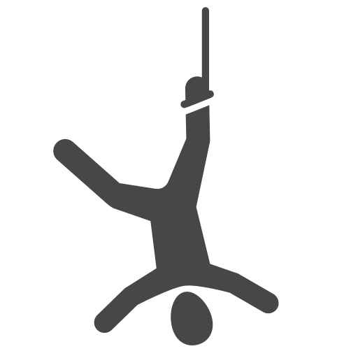

# HANG HANG REVOLUTION RELOADED 🎮

A retro-themed Hangman game built with React, TypeScript, and Tailwind CSS, featuring an arcade-style UI with neon effects and animations.



## 🌟 Features

- 🕹️ Retro arcade-style interface with neon effects
- 💫 Smooth animations and transitions
- 🏆 Persistent high score system
- 📱 Responsive design
- 🎯 Word guessing gameplay
- 📊 Leaderboard system

## 🚀 Getting Started

### Prerequisites

- Node.js (v14 or higher)
- npm or yarn

### Installation

1. Clone the repository:
```bash
git clone https://github.com/yourusername/hangman-js.git
cd hangman-js
```

2. Install dependencies:
```bash
npm install
```

3. Start the development server:
```bash
npm run dev
```

The game will be available at `http://localhost:3000`

## 🛠️ Tech Stack

- **Frontend:**
  - React
  - TypeScript
  - Tailwind CSS
  - Vite

- **Backend:**
  - Express.js
  - Node.js
  - File-based storage (leaderboard.json)

## 🎨 Theme Customization

The game uses a custom retro theme defined in `tailwind.config.js`. Key design elements include:

- Custom colors (defined in theme.extend.colors.retro)
- Custom animations (defined in theme.extend.animation)
- Retro grid backgrounds
- Neon glow effects
- Scanline animations

### Color Palette
```javascript
colors: {
    retro: {
        pink: '#ff00ff',
        blue: '#00ffff',
        purple: '#9900ff',
        yellow: '#ffff00',
        green: '#00ff00',
    }
}
```

## 📁 Project Structure

```
hangman-js/
├── src/
│   ├── components/
│   │   ├── molecules/
│   │   │   ├── Hangman/
│   │   │   ├── Typer/
│   │   │   └── word-display/
│   │   └── views/
│   │       ├── Game/
│   │       ├── GameOver/
│   │       ├── Home/
│   │       └── Leaderboard/
│   ├── services/
│   │   ├── save-leaderboard.service.ts
│   │   └── word.service.ts
│   └── main.tsx
├── public/
├── server.ts
└── tailwind.config.js
```

## 🎮 Game Components

- **Home:** Main menu screen with start game and leaderboard options
- **Game:** Main gameplay screen with word display and letter input
- **GameOver:** End game screen with score display and name input
- **Leaderboard:** High scores display with player rankings

## 💾 Data Storage

The game uses a file-based storage system (`leaderboard.json`) to persist high scores. The structure is:

```typescript
interface Player {
    name: string;
    score: number;
    date: string;
}

interface LeaderboardData {
    players: Player[];
}
```

## 🔧 Development

### Available Scripts

- `npm run dev` - Start development server
- `npm run build` - Build for production
- `npm run preview` - Preview production build

### Adding New Features

1. **New Components:**
   - Create component in appropriate directory
   - Use existing theme utilities
   - Follow retro design patterns

2. **Styling:**
   - Use Tailwind classes
   - Follow retro theme guidelines
   - Maintain responsive design

3. **State Management:**
   - Use React hooks for local state
   - Update leaderboard through service

## 📝 TODO

- [ ] Create SVGs for hangman states
- [ ] Add sound effects and retro music
- [ ] Implement difficulty levels
- [ ] Add animation transitions between screens
- [ ] Create mobile-optimized touch controls

## 🤝 Contributing

1. Fork the repository
2. Create your feature branch (`git checkout -b feature/AmazingFeature`)
3. Commit your changes (`git commit -m 'Add some AmazingFeature'`)
4. Push to the branch (`git push origin feature/AmazingFeature`)
5. Open a Pull Request

## 📄 License

This project is licensed under the MIT License - see the LICENSE file for details.

## 🙏 Acknowledgments

- Font: Press Start 2P from Google Fonts
- Icons and assets from [source]
- Inspiration from classic arcade games